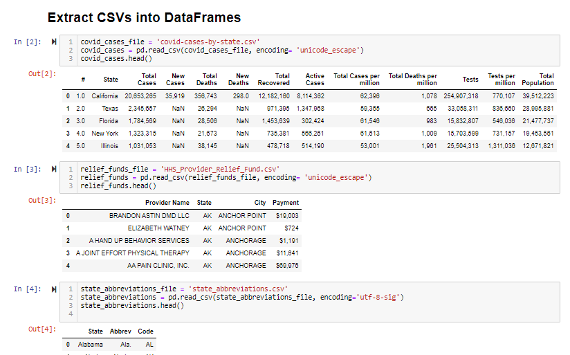
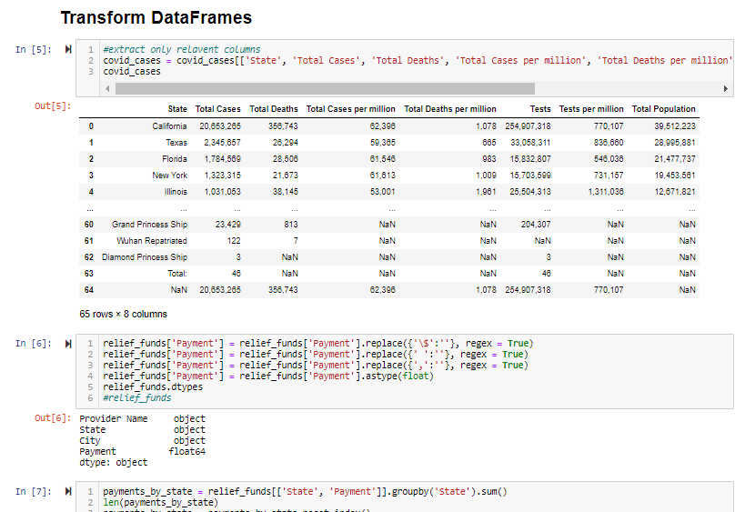
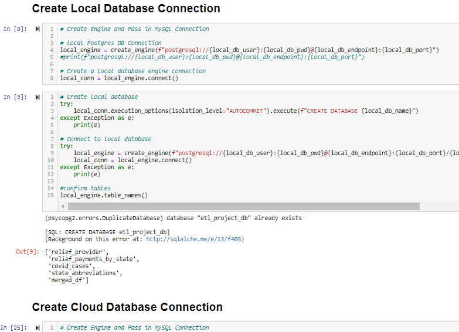
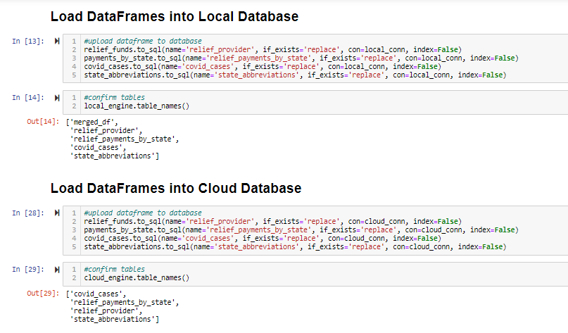

# etl-project --- Comparing Covid Cases by State

## Finding Data

This project used 3 data sources from kaggle, data world, and the United States Department of Health and Human Services.  The data sets were saved down as CSVs. 

These data sets illustrate:

1) covid cases by state
2) HHS relief funds provided
3) state abbreviations

## Extract data

* After the data was gathered, the first step was to extract the data into data frames using python pandas. 

* Each data set was given its own data frame

## Transform the data

* Once the data frames were created, the next step was to merge them into one central table

* This included removing any columns not needed, and formatting the relevant columns to be more legible

## Load data into local and cloud databases

* Once happy with the final dataframes created, the final step is to connect to our databases using sqlalchemy 

* For our local database, we used mySQL. For our cloud databse, we used AWS.

* After connecting to the databases via create_engine, the last step was to upload the dataframes to these databases using to_sql.

- - -

